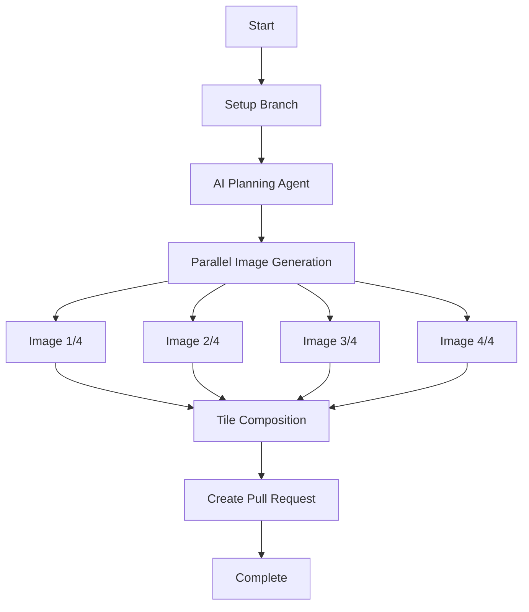

# 🎨 Tile Image Generation Workflow

AI-powered workflow for generating 4 related images and composing them into a single tile layout.

## ✨ Features

- **🚀 Parallel Generation**: Creates 4 images simultaneously for maximum efficiency
- **🎨 Multi-Model Support**: Compatible with 5 different AI image generation models
- **📐 Flexible Layouts**: Choose from 2x2 grid, 1x4 horizontal, or 4x1 vertical arrangements
- **🤖 Smart Planning**: AI-powered prompt generation for cohesive image sets
- **🖼️ Professional Composition**: High-quality tile assembly using ImageMagick
- **⚡ Fast Processing**: Optimized workflow completing in 15-25 minutes

## 🎯 Use Cases

### 🎨 Design & Creative
- Icon sets and UI elements
- Mood boards and style guides  
- Brand identity exploration
- Artistic concept variations

### 📚 Educational Content
- Step-by-step tutorials
- Process illustrations
- Comparison charts
- Timeline visualizations

### 📢 Marketing Materials
- Product feature highlights
- Before/after comparisons
- Seasonal campaigns
- Social media content

### 🏢 Business Applications
- Presentation graphics
- Report illustrations
- Team building materials
- Company culture displays

## 🚀 Quick Start

### 1. Setup Repository
```bash
git clone https://github.com/YOUR_USERNAME/kamuicode-workflow.git
cd kamuicode-workflow
cp tile-image-generation-workflow/create-tile-images.yml .github/workflows/
```

### 2. Configure Secrets
- `CLAUDE_CODE_OAUTH_TOKEN`: Claude Code authentication
- `PAT_TOKEN`: GitHub Personal Access Token

### 3. Run Workflow
1. Go to **Actions** → **Create Tile Images (4x Grid)**
2. Click **Run workflow**
3. Enter your parameters:
   ```
   Main Concept: "Four seasons of Japan"
   Image Model: "t2i-fal-imagen4-fast"
   Tile Layout: "2x2"
   ```
4. Click **Run workflow**

## 📊 Workflow Process



## 🎨 Supported Models

| Model | Quality | Speed | Best For |
|-------|---------|-------|----------|
| `t2i-google-imagen3` | ⭐⭐⭐⭐⭐ | ⭐⭐⭐ | Highest quality needs |
| `t2i-fal-imagen4-ultra` | ⭐⭐⭐⭐⭐ | ⭐⭐ | Professional commercial use |
| `t2i-fal-imagen4-fast` | ⭐⭐⭐⭐ | ⭐⭐⭐⭐ | **Recommended - Balanced** |
| `t2i-fal-flux-schnell` | ⭐⭐⭐ | ⭐⭐⭐⭐⭐ | Rapid prototyping |
| `t2i-fal-rundiffusion-photo-flux` | ⭐⭐⭐⭐ | ⭐⭐⭐ | Photorealistic images |

## 📐 Layout Options

### 2x2 Grid (Recommended)
```
┌─────┬─────┐
│  1  │  2  │
├─────┼─────┤
│  3  │  4  │
└─────┴─────┘
```
Perfect for: Themes, seasons, emotions, categories

### 1x4 Horizontal
```
┌───┬───┬───┬───┐
│ 1 │ 2 │ 3 │ 4 │
└───┴───┴───┴───┘
```
Perfect for: Processes, timelines, progressions

### 4x1 Vertical
```
┌─────┐
│  1  │
├─────┤
│  2  │
├─────┤
│  3  │
├─────┤
│  4  │
└─────┘
```
Perfect for: Steps, evolution, hierarchy

## 💡 Example Concepts

### 🌸 Nature & Seasons
```yaml
main_concept: "Four seasons in a Japanese garden"
tile_layout: "2x2"
image_model: "t2i-fal-imagen4-fast"
```

### 🏙️ Architecture & Design
```yaml
main_concept: "Modern minimalist interior design styles"
tile_layout: "2x2"
image_model: "t2i-fal-imagen4-ultra"
```

### 🍕 Food & Culinary
```yaml
main_concept: "Italian cuisine preparation steps"
tile_layout: "1x4"
image_model: "t2i-fal-rundiffusion-photo-flux"
```

### 🎭 Art & Expression
```yaml
main_concept: "Abstract emotions through color and form"
tile_layout: "4x1"
image_model: "t2i-google-imagen3"
```

## 🛠️ Advanced Configuration

### Custom Prompts
Specify exact prompts for each image:
```json
{
  "1": "Sunrise over mountains with golden light",
  "2": "Midday forest scene with vibrant greens", 
  "3": "Sunset by the ocean with warm colors",
  "4": "Starry night sky with moon reflection"
}
```

### Model Selection Guide

**For Speed**: `t2i-fal-flux-schnell`
- Processing time: ~5-10 minutes
- Quality: Good for drafts and iterations

**For Balance**: `t2i-fal-imagen4-fast` ⭐ **Recommended**
- Processing time: ~10-15 minutes  
- Quality: Excellent for most use cases

**For Quality**: `t2i-fal-imagen4-ultra`
- Processing time: ~20-25 minutes
- Quality: Professional commercial grade

**For Photos**: `t2i-fal-rundiffusion-photo-flux`
- Processing time: ~15-20 minutes
- Quality: Photorealistic results

## 📁 Generated Output

Each workflow run creates:
```
tile-images-YYYYMMDD-RUNID/
├── planning/
│   ├── tile-plan.md              # Overall strategy
│   ├── image-prompt-1.txt        # Individual prompts
│   ├── image-prompt-2.txt
│   ├── image-prompt-3.txt
│   ├── image-prompt-4.txt
│   └── tile-concept.txt          # Unified concept
├── images/
│   ├── tile-image-1.png          # Individual images
│   ├── tile-image-2.png
│   ├── tile-image-3.png
│   └── tile-image-4.png
├── final/
│   └── tile-composed.png         # Final composition
├── google-image-url-1.txt        # External URLs
├── google-image-url-2.txt
├── google-image-url-3.txt
└── google-image-url-4.txt
```

## ⏱️ Performance

| Layout | Images | Avg. Time | Parallel Jobs |
|--------|--------|-----------|---------------|
| 2x2    | 4      | 15-20 min | 4 concurrent  |
| 1x4    | 4      | 15-20 min | 4 concurrent  |
| 4x1    | 4      | 15-20 min | 4 concurrent  |

*Times vary based on selected model and API response times*

## 🔧 Technical Details

### Dependencies
- **GitHub Actions**: Workflow execution
- **Claude Code SDK**: AI agent orchestration  
- **ImageMagick**: Image composition
- **kamuicode MCP**: AI model access

### Requirements
- Claude Code OAuth Token
- GitHub Personal Access Token
- kamuicode MCP configuration

## 📖 Documentation

- **[Setup Guide](SETUP.md)**: Complete installation instructions
- **[Workflow File](create-tile-images.yml)**: Technical implementation

## 🆘 Support

### Common Issues

**Workflow fails to start**
- Check Secrets configuration
- Verify workflow file is on default branch

**Image generation fails**  
- Validate API key permissions
- Check MCP configuration
- Review Actions logs for details

**Tile composition fails**
- Ensure all 4 images generated successfully
- Check ImageMagick installation
- Verify layout parameter is valid

### Getting Help

1. Check [Setup Guide](SETUP.md) for configuration
2. Review GitHub Actions logs for errors
3. Validate MCP and Claude Code settings
4. Ensure all required Secrets are configured

## 🤝 Contributing

We welcome contributions! Please:
1. Fork the repository
2. Create a feature branch
3. Submit a pull request with detailed description

## 📄 License

This project is licensed under the MIT License - see the [LICENSE](LICENSE) file for details.

## 🙏 Acknowledgments

- Built with [Claude Code](https://docs.anthropic.com/en/docs/claude-code)
- Powered by [kamuicode](https://github.com/kamuicode) MCP integration
- Image processing via [ImageMagick](https://imagemagick.org/)

---

**Created**: July 24, 2025  
**Version**: 1.0.0  
**Compatibility**: Claude Code, GitHub Actions, kamuicode MCP